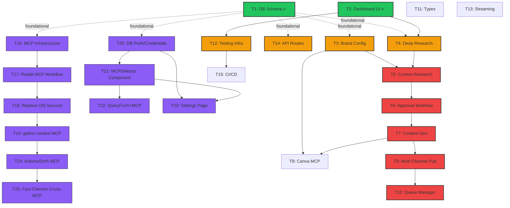

# Parallelization & Execution Report

This document outlines the optimal parallelization strategy for the Research Publishing Suite project. Based on dependency analysis and task complexity, we can divide the work into parallel streams to accelerate development.

**Status Update (Feb 2026):**
- ✅ **Phase 1 COMPLETED**: T1 (DB Schema) + T2 (Dashboard UI) done
- 🚀 **Phase 2 ACTIVE**: Starting T3 + T4 + T14 + T12 in parallel on `feat/phase2-core`
- 🔮 **Phase 2.5 PLANNED**: MCP Research Sources integration (T16-T25) in `feat/mcp-research-sources`

## 📊 Updated Dependency Graph (Including MCP Tasks T16-T25)



## 🚀 Execution Phases & Parallel Streams

### Phase 1: Foundation (Epoch 0) ✅ COMPLETED
*Goal: Establish the database schema and UI shell to unblock all other tasks.*

| Stream | Branch | Tasks | Dependencies | Status | Notes |
|--------|--------|-------|--------------|--------|-------|
| **Backend** | `feat/db-schema` | **Task 1** (DB Schema) <br> **Task 11** (Types) | None | ✅ Done | **CRITICAL PATH**. Completed first. |
| **Frontend** | `feat/ui-shell` | **Task 2** (Dashboard) | None | ✅ Done | Ran in parallel with Backend. |

---

### Phase 2: Core Infrastructure (Epoch 1) 🚀 IN PROGRESS
*Goal: Build the specialized pillars independently in parallel.*
*Prerequisites: Phase 1 merged.* **Branch: `feat/phase2-core`**

**Strategy:** All 4 tasks in parallel on single branch for rapid integration and single PR merge.

| Stream | Tasks | Dependencies | Complexity | Notes |
|--------|-------|--------------|------------|-------|
| **Brand** | **Task 3** (Brand Config) | T1 ✅ | 5/10 | API routes + UI components for brand management. Unblocks T5 (Context). |
| **Research** | **Task 4** (Deep Research Refactor) | T1 ✅, T2 ✅ | 6/10 | Refactor orchestrator + event schemas. Core agent for Phase 3. Supports both old sources + MCP (temporary). |
| **Infra** | **Task 14** (API Routes) | T1 ✅, T11, T2 ✅ | 4/10 | REST API foundation for all phases. Core dependency for next phases. |
| **Testing** | **Task 12** (Testing Infra) | T2 ✅ | 5/10 | Jest + Playwright setup. Required for CI/CD (T15). |

**Execution Order (sequential within single container):**
```
T14 (API routes base) → T12 (testing infra) → T3 (brand + APIs) → T4 (research refactor)
```

**Alternative (Container-Use with 4 parallel containers):**
```
Container 1: T3 → (brand-config branch)
Container 2: T4 → (deep-research branch)
Container 3: T14 → (api-routes branch)
Container 4: T12 → (testing-infra branch)
All complete ✅ → Merge all 4 to feat/phase2-core → Single PR
```

---

### Phase 2.5: MCP Research Sources (Epoch 1.5) 🔮 PLANNED
*Goal: Integrate production MCP clients for dynamic research source selection.*
*Can start in parallel to Phase 2 after T1 completes. Prerequisite: Phase 2 merged.*
**Branch: `feat/mcp-research-sources`**

**Two Parallel Streams:**

**Stream A: MCP Backend Infrastructure**
| Task | Dependencies | Complexity | Notes |
|------|--------------|------------|-------|
| **T16** (MCP Infrastructure) | T1 ✅ | 8/10 | Create MCP clients for Jina, Firecrawl, Reddit, Google Deep Research. |
| **T17** (Reddit MCP Workflow) | T16 | 6/10 | Subreddit mapping + multi-source fetch + comment depth. No auth needed. |
| **T18** (Replace Old Sources) | T16, T17 | 4/10 | Archive ArXiv/GitHub sources. Create wrappers for new MCPs. |
| **T19** (Update gather-context) | T18 | 5/10 | Modify orchestrator to accept `selectedMCPs` array. Route queries to MCP router. |

**Stream B: MCP UI & Settings**
| Task | Dependencies | Complexity | Notes |
|------|--------------|------------|-------|
| **T20** (DB Prefs/Credentials) | T1 ✅ | 4/10 | Add UserPreferences + APICredential models. Encrypted credential storage. |
| **T21** (MCPSelector Component) | T20 | 4/10 | Reusable component: 1-4 MCP selection with status indicators. |
| **T22** (QueryForm + MCP) | T21 | 4/10 | Add Advanced Options with MCPSelector. Dynamic source selection. |
| **T23** (Settings Page) | T20, T21 | 7/10 | Full settings UI: credentials, defaults, MCP status. API routes for CRUD. |

**Integration Tasks:**
| Task | Dependencies | Complexity | Notes |
|------|--------------|------------|-------|
| **T24** (Actions/Orchestrator MCP) | T19 | 5/10 | Update server actions + events to pass `selectedMCPs`. Credential loading. |
| **T25** (Fact-Checker Cross-MCP) | T19, T24 | 4/10 | Enhanced fact-checking across multiple sources. Reddit opinion handling. |

### Phase 3: The Intelligence Chain (Epoch 2) ⏳ BLOCKED until Phase 2 complete
*Goal: Implement the primary agentic workflow. This is the **CRITICAL PATH**.*
*Prerequisites: Phase 2 merged.*
**Branch: `feat/intelligence-core`**

**SEQUENTIAL CHAIN (Cannot Parallelize - assign senior engineers here):**

| Order | Task | Dependencies | Complexity | Notes |
|-------|------|--------------|------------|-------|
| 1️⃣ | **Task 5** (Context Research) | T3 ✅, T4 ✅, (T19 optional) | 7/10 | Multi-agent analysis network (theme, opportunity, trend). Uses brand context matching. |
| 2️⃣ | **Task 6** (Approval Workflow) | T5 ✅ | 5/10 | Human-in-the-loop with waitForEvent pattern (7-day timeout). Approval UI component. |
| 3️⃣ | **Task 7** (Content Generation) | T6 ✅ | 6/10 | Unified writer agent. Multi-format content (blog, social, product desc). Triggers approval workflow. |

**Optional Parallel (after T7):**
- **Task 24** (Actions/Orchestrator MCP) - Integrate MCP selection into orchestrator
- **Task 25** (Fact-Checker Cross-MCP) - Enhanced fact-checking across multiple sources

---

### Phase 4: Integrations & Polish (Epoch 3) ⏳ BLOCKED until Phase 3 complete
*Goal: Connect to external world and refine.*
*Prerequisites: Task 7 (Content Gen) completed.*

| Stream | Tasks | Dependencies | Complexity | Notes |
|--------|-------|--------------|------------|-------|
| **Design** | **Task 8** (Canva MCP) | T3 ✅, T7 ✅ | 7/10 | MCP integration for automated design creation. Brand guideline alignment. |
| **Publishing** | **Task 9** (Multi-Channel Pub) | T7 ✅, T6 ✅ | 8/10 | Platform-specific publishers (Shopify, Twitter, LinkedIn, Instagram). Highest complexity. |
| **Publishing** | **Task 10** (Queue Manager) | T9 ✅, T1 ✅ | 6/10 | Exponential backoff, retry logic, audit logging. Depends on T9. |
| **Realtime** | **Task 13** (Streaming) | All Core Tasks ✅ | 5/10 | Unified progress tracking across all 4 phases. Phase-specific realtime topics. |
| **DevOps** | **Task 15** (CI/CD) | T12 ✅ | 4/10 | GitHub Actions CI/CD pipeline. Parallel test execution. Can start after Phase 2. |

## ⏱️ Complexity & Resource Allocation

### Current Phase (Phase 2) - Resource Priorities

*   **High Complexity (Assign Senior Devs):**
    *   Task 4 (Deep Research Refactor) - Score 6/10
    *   Task 23 (Settings Page) - Score 7/10

*   **Medium Complexity (Senior/Mid-level):**
    *   Task 3 (Brand Config) - Score 5/10
    *   Task 12 (Testing Infra) - Score 5/10
    *   Task 14 (API Routes) - Score 4/10

*   **Low Complexity (Good for New Devs / Quick Wins):**
    *   Task 11 (Types) - Score 3/10 ✅ Done
    *   Task 15 (CI/CD) - Score 4/10 (later phase)

### Phase 2.5 MCP Tasks - Resource Priorities

*   **High Complexity (Assign Senior Devs):**
    *   Task 16 (MCP Infrastructure) - Score 8/10
    *   Task 19 (Update gather-context) - Score 5/10
    *   Task 24 (Actions/Orchestrator MCP) - Score 5/10

*   **Medium Complexity:**
    *   Task 17 (Reddit Workflow) - Score 6/10
    *   Task 23 (Settings Page) - Score 7/10
    *   Task 25 (Fact-Checker) - Score 4/10

*   **Low Complexity (Good for learning MCPs):**
    *   Task 18 (Replace Sources) - Score 4/10
    *   Task 20 (DB Models) - Score 4/10
    *   Task 21 (MCPSelector) - Score 4/10
    *   Task 22 (QueryForm) - Score 4/10

### Intelligence Chain (Phase 3) - CRITICAL PATH

*   **Highest Complexity (Best Senior Engineers):**
    *   Task 5 (Context Research Agent) - Score 7/10 ⚠️ Complex multi-agent orchestration
    *   Task 7 (Content Generation) - Score 6/10
    *   Task 6 (Approval Workflow) - Score 5/10

---

## 🚦 Current & Recommended Next Steps

### ✅ Phase 1 Complete - Now Execute Phase 2

1. **IMMEDIATE (Today)**: Start Phase 2 on `feat/phase2-core` with all 4 tasks in parallel:
   - Container-Use MCP: 4 parallel containers (T3, T4, T14, T12)
   - OR: Single container with sequential commits (T14 → T12 → T3 → T4)
   - Estimated time: 3-5 days
   - Single PR merge on completion

2. **PARALLEL (Can start after T1, before Phase 2 merge)**: Phase 2.5 prep work
   - Research MCP documentation (Jina, Firecrawl, Reddit APIs)
   - Design MCP client architecture
   - Create branches ready for implementation

3. **BLOCKING POINT**: Phase 2 MUST complete and merge before starting Phase 3 (Intelligence Chain)
   - T3 required for T5
   - T4 required for T5
   - T1+T2 already merged ✅

4. **For Phase 2.5 (Post-Phase 2)**: 
   - MCP Backend Stream (T16→T17→T18→T19) can proceed in parallel with Core Phase 3 start
   - MCP UI Stream (T20→T21→T22→T23) can proceed independently
   - Adds dynamic source selection by mid-development cycle

### 📊 Timeline Estimate

```
Now:        Phase 2 starts (T3+T4+T14+T12) ............. 3-5 days
           ↓
Complete:  Phase 2 merges to main ✅
           ↓
Parallel:  Phase 3 begins (T5→T6→T7) AND Phase 2.5 (MCP tasks)
           ↓
           Phase 3 complete (9-12 days sequential) + Phase 2.5 (7-10 days MCP)
           ↓
           Phase 4 begins (T8, T9→T10, T13, T15)
```

### 🔧 Important Notes

- **Dev Tools** (Next.js 16 DevTools MCP, shadcn MCP): Setup manually - not tracked in task system
- **Container-Use MCP**: Recommended for Phase 2 parallel execution
- **TestSprite MCP**: Required for pre-PR validation of Phase 2 tasks
