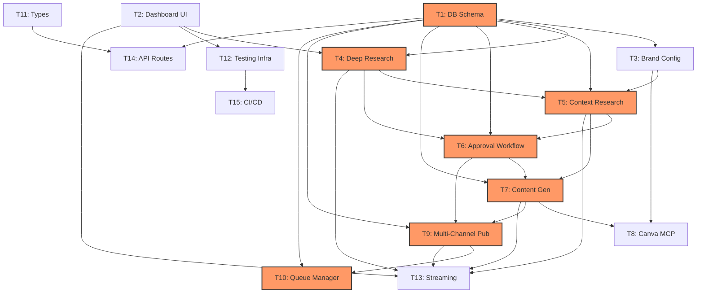

# Parallelization & Execution Report

This document outlines the optimal parallelization strategy for the Research Publishing Suite project. Based on dependency analysis and task complexity, we can divide the work into parallel streams to accelerate development.

## 📊 Dependency Graph

## 🚀 Execution Phases & Parallel Streams

### Phase 1: Foundation (Epoch 0)
*Goal: Establish the database schema and UI shell to unblock all other tasks.*

| Stream | Branch | Tasks | Dependencies | Notes |
|--------|--------|-------|--------------|-------|
| **Backend** | `feat/db-schema` | **Task 1** (DB Schema)   **Task 11** (Types) | None | **CRITICAL PATH**. Must merge first. |
| **Frontend** | `feat/ui-shell` | **Task 2** (Dashboard) | None | Can run fully in parallel with Backend. |

### Phase 2: Core Infrastructure (Epoch 1)
*Goal: Build the specialized pillars independently.*
*Prerequisites: Phase 1 merged.*

| Stream | Branch | Tasks | Dependencies | Notes |
|--------|--------|-------|--------------|-------|
| **Brand** | `feat/brand-config` | **Task 3** (Brand Config) | T1 | Unblocks Context Research (T5). |
| **Research** | `feat/deep-research` | **Task 4** (Deep Research) | T1, T2 | Refactor existing agent. Unblocks Context (T5). |
| **Infra** | `feat/infra-setup` | **Task 14** (API Routes)   **Task 12** (Testing) | T1, T11, T2 | Sets up testing and API foundation. |

### Phase 3: The Intelligence Chain (Epoch 2)
*Goal: Implement the primary agentic workflow. This is the **Critical Path**.*
*Prerequisites: Phase 2 merged.*

**Sequential Chain (Cannot Parallelize):**
1.  **Task 5** (Context Research) - Depends on T3, T4.
2.  **Task 6** (Approval Workflow) - Depends on T5.
3.  **Task 7** (Content Generation) - Depends on T6.

*Recommendation: Assign best engineers here. Execute sequentially on `feat/intelligence-core` or separate branches merged strictly in order.*

### Phase 4: Integrations & Polish (Epoch 3)
*Goal: Connect to external world and refine.*
*Prerequisites: Task 7 (Content Gen) completed.*

| Stream | Branch | Tasks | Dependencies | Notes |
|--------|--------|-------|--------------|-------|
| **Design** | `feat/canva-mcp` | **Task 8** (Canva) | T3, T7 | Independent integration. |
| **Publishing**| `feat/publishing` | **Task 9** (Multi-Channel)   **Task 10** (Queue) | T1, T6, T7 | T10 follows T9 immediately. |
| **Realtime** | `feat/streaming` | **Task 13** (Streaming) | All Core Tasks | Can start earlier but needs core events stable. |
| **DevOps** | `feat/cicd` | **Task 15** (CI/CD) | T12 | Can be done anytime after Phase 2. |

## ⏱️ Complexity & Resource Allocation

*   **High Complexity (Assign Senior Devs):**
    *   Task 9 (Multi-Channel Publishing) - Score 8/10
    *   Task 5 (Context Research) - Score 7/10
    *   Task 8 (Canva MCP) - Score 7/10

*   **Medium Complexity:**
    *   Task 4, 6, 7, 10 - Score 6/10

*   **Low Complexity (Good for Junior Devs / Quick Wins):**
    *   Task 1, 2, 11, 14, 15 - Score 3-4/10

## 🚦 Recommended Next Steps

1.  **Start Task 1 (DB Schema)** immediately. This creates the `prisma/schema.prisma` and `src/lib/db.ts` file which are dependencies for 80% of the project.
2.  **Start Task 2 (Dashboard)** in parallel. It touches `src/app` and components, avoiding merge conflicts with Task 1.
3.  **Pause** other tasks until T1 and T2 are merged to avoid massive refactoring of database calls.
